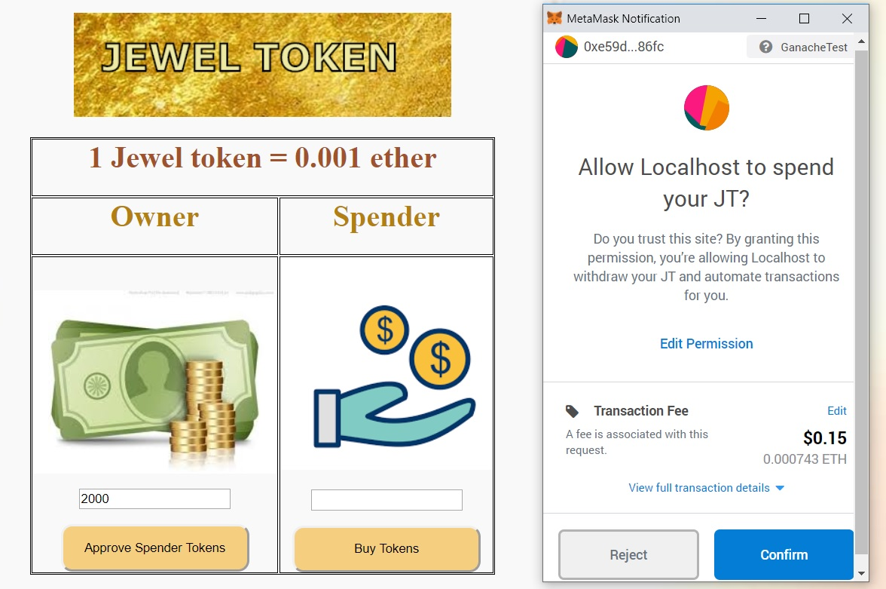
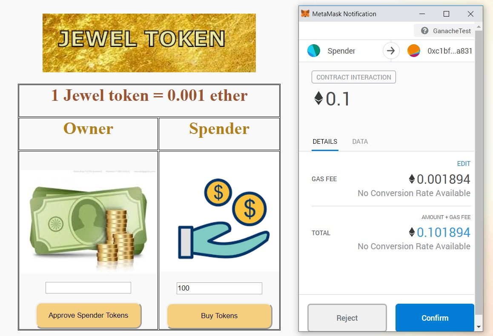
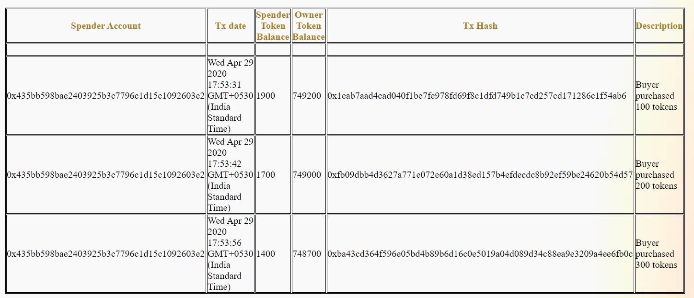
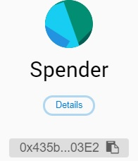

# Jewel Token cryptocurrency : ERC20 compliant

This project showcases a crowd sale application with buying of cryptocurrency named 'Jewel Token'


#### What we are providing?
---

- A smart contract for creating a token compliant to ERC20 standards
- A crowd sale DApp to purchase tokens by the investors.

#### Included Components
---
-  Solidity (Ethereum)
-  Metamask  (Ethereum wallet)
-  Truffle (npm install -g truffle or on linux sudo npm install -g truffle)
-  Web3JS
-  Ganache

#### Prerequisites
---
- Nodejs v9.10 or above
- Truffle v4.1.8 (core: 4.1.8) (http://truffleframework.com/docs/getting_started/installation)
- Solidity v0.5.0
- Metamask (https://metamask.io) /Ganache Wallet
- Ganache App
- npm install

#### Deployment Steps:
---
**Setting up Ethereum Smart Contract:**

```
git clone https://github.com/anithakc6/ERC20JewelToken.git
cd ERC20JewelToken/
```
Go to your project folder in terminal then execute :

```
truffle compile
truffle migrate (if second time, truffle migrate --reset)
npm run dev
Connect Metamask to Ganache URL http://localhost:7545
```

#### Development Screen's
---

#### Approval of Spender Allowed Tokens
---
- Approval -> Approve the allowed limit of tokens of the spender.
- Metamask account - Checkout for the metamask account details below.



#### Crowd Sale to purchase tokens
---
- Spender spends ethers to purchase Jewel tokens. Here 0.001 ether = 1 Jewel Token.
- Metamask account - Checkout for the metamask account details below.



#### Transaction balance sheet
---
- A table with details of tokens sold, tokens remiaings, transaction details etc are displayed



#### Metamask Account Details
---
In this project, various different account addresses are used for participants,
Rename these accounts in metamask for doing transactions.

1) Owner -> Any address
---

2) Spender -> 0x435bB598bae2403925B3c7796c1d15c1092603E2
(If different address to be used, change the same in app.js file)
---

